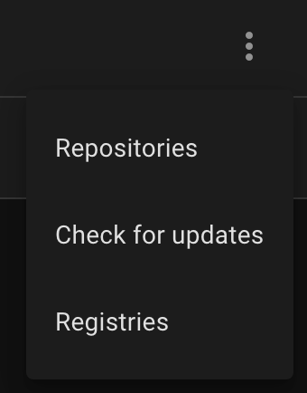
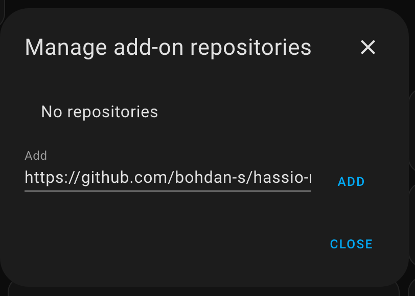
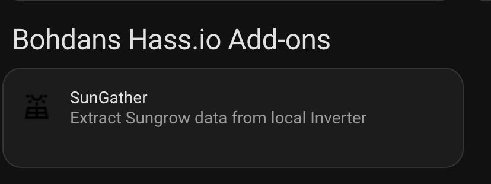

# Hassio add-on Repository
This repository contains Hass.io add-ons. All add-ons in this repository are tested on Hass.io, Home Assistant Core installation is not supported.

### Installation
1. Navigate in your Home Assistant frontend to <kbd>Supervisor</kbd> -> <kbd>Add-on Store</kbd>.

2. Click the 3-dots menu at upper right <kbd>...</kbd> > <kbd>Repositories</kbd> and add this repository's URL: [https://github.com/bohdan-s/hassio-repository](https://github.com/bohdan-s/hassio-repository)

3. Scroll down the page to find the new repository, and click the new add-on named you want. Ex:

   

4. Click <kbd>Install</kbd> and give it a few minutes to finish downloading.

5. Follow the instruction for each addon to configures

### Updating
Enable `Auto update` on the desired add-on or browse Hassio Add-on Store Tab to check for update

# Add-ons in this Repository

### SunGather
This addon support Sungrow Solar Inverter to publish data to MQTT Broker with AutoDiscovery. 
This add on based on [SunGather](https://github.com/bohdan-s/SunGather)
