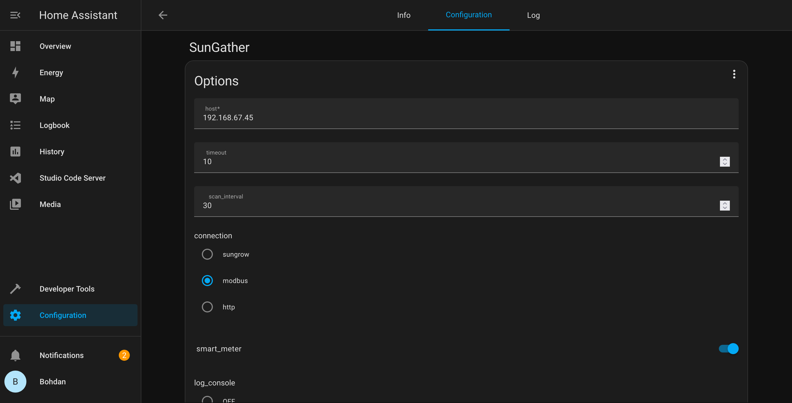
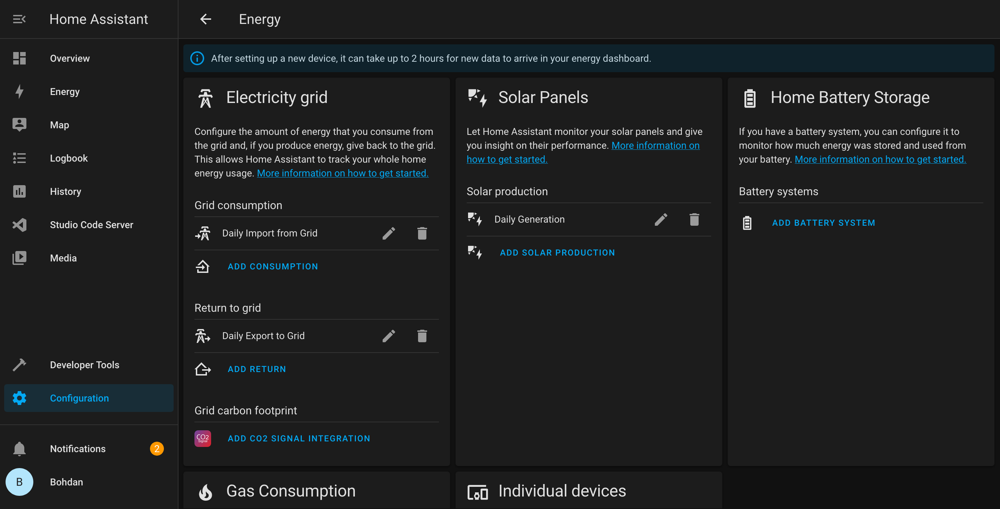

[![Contributors][contributors-shield]][contributors-url]
[![Forks][forks-shield]][forks-url]
[![Stargazers][stars-shield]][stars-url]
[![Issues][issues-shield]][issues-url]
[![GPL3 License][license-shield]][license-url]

 

<h2 align="center">SunGather HomeAssistant Add-on</h2>

  

    Collect data from Sungrow Inverters using ModbusTcpClient, <a href="https://github.com/rpvelloso/Sungrow-Modbus">SungrowModbusTcpClient</a> or <a href="https://github.com/bohdan-s/SungrowModbusWebClient">SungrowModbusWebClient</a> and export to various locations.
     
     
    <a href="https://sungather.net">Website Sungather.net</a>
    ·
    <a href="https://github.com/bohdan-s/hassio-repository/issues">Report Bug</a>
    ·
    <a href="https://github.com/bohdan-s/hassio-repository/issues">Request Feature</a>
  

<!-- ABOUT THE PROJECT -->
## About The Project

<b>Join the Discord Server to discuss, suggestions or for any help: <a href="https://discord.gg/7j2MVsT5wn">SunGather Discord</a></b>

<b>If you are looking for the stand alone SunGather, see: <a href="https://github.com/bohdan-s/SunGather">SunGather</a></b>
 
Has HomeAssistant out of the box!

If you want more functionality you can edit the /share/config.yaml file, see <a href="https://github.com/bohdan-s/SunGather/blob/main/SunGather/config-example.yaml">https://github.com/bohdan-s/SunGather/blob/main/SunGather/config-example.yaml</a>
* Console - Log directly to screen
* MQTT - Generic MQTT Support
* PVOutput - Load into PVOutput.org
* InfluxDB - Load data directly into InfluxDB (v1.8 or v2.x)
* Prometheus - Scrape from /metrics endpoint
* Simple webserver showing collected data
* Rasberry Pi Docker support
* and more coming....

(<a href="#top">back to top</a>)

<!-- GETTING STARTED -->
## Getting Started
### Home Assistant setup

In the SunGather Configuration you need to set the smart_meter if you have one  
_For Hybrid Models smart_meter doesn't need to get enabled_

Set You IP and Change connection types if the default does not work.

Once running the sensors will be auto created

If you want to use Energy:
* Electricity Grid > Grid Consumption -> Daily Import from Grid 
* Electricity Grid > Return to Grid -> Daily Export to Grid
* Solar Panels > Solar Production -> Daily Generation 

(<a href="#top">back to top</a>)

## Tested Devices
* SG7.0RT with WiNet-S Dongle
* SG10RT with WiNet-S Dongle and Ethernet (Credit: @rark-ha)
* SH6.0RT with WiNet-S Dongle
* SH10RT(-V112) with WiNet-S Dongle and Ethernet

(<a href="#top">back to top</a>)

## Supported Devices
### PV Grid-Connected String Inverters
SG30KTL, SG10KTL, SG12KTL, SG15KTL, SG20KTL, SG30KU, SG36KTL, SG36KU, SG40KTL, SG40KTL-M, SG50KTL-M, SG60KTL-M, SG60KU, SG30KTL-M, SG30KTL-M-V31, SG33KTL-M, SG36KTL-M, SG33K3J, SG49K5J, SG34KJ, LP_P34KSG, SG50KTL-M-20, SG60KTL, SG80KTL, SG80KTL-20, SG60KU-M, SG5KTL-MT, SG6KTL-MT, SG8KTL-M, SG10KTL-M, SG10KTL-MT, SG12KTL-M, SG15KTL-M, SG17KTL-M, SG20KTL-M, SG80KTL-M, SG111HV, SG125HV, SG125HV-20, SG30CX, SG33CX, SG36CX-US, SG40CX, SG50CX, SG60CX-US, SG110CX, SG250HX, SG250HX-US, SG100CX, SG100CX-JP, SG250HX-IN, SG25CX-SA, SG75CX, SG3.0RT, SG4.0RT, SG5.0RT, SG6.0RT, SG7.0RT, SG8.0RT, SG10RT, SG12RT, SG15RT, SG17RT, SG20RT

### PV Grid-Connected String Inverters Gen 2
SG5K-D, SG8K-D

### Residential Hybrid Inverters
SH5K-20, SH3K6, SH4K6, SH5K-V13, SH5K-30, SH3K6-30, SH4K6-30, SH5.0RS, SH3.6RS, SH4.6RS, SH6.0RS, SH10RT(-V112), SH8.0RT, SH6.0RT, SH5.0RT

(<a href="#top">back to top</a>)

<!-- LICENSE -->
## License

Distributed under the GPL3 License. See `LICENSE.txt` for more information.

(<a href="#top">back to top</a>)

<!-- CONTACT -->
## Contact

Project Link: [https://github.com/bohdan-s/SunGather](https://github.com/bohdan-s/SunGather)

(<a href="#top">back to top</a>)

<!-- ACKNOWLEDGMENTS -->
## Acknowledgments

* [solariot](https://github.com/meltaxa/solariot)
* [modbus4mqtt](https://github.com/tjhowse/modbus4mqtt)
* [ModbusTCP2MQTT](https://github.com/TenySmart/ModbusTCP2MQTT)

(<a href="#top">back to top</a>)

<!-- MARKDOWN LINKS & IMAGES -->
<!-- https://www.markdownguide.org/basic-syntax/#reference-style-links -->
[contributors-shield]: https://img.shields.io/github/contributors/bohdan-s/hassio-repository.svg?style=for-the-badge
[contributors-url]: https://github.com/bohdan-s/hassio-repository/graphs/contributors
[forks-shield]: https://img.shields.io/github/forks/bohdan-s/hassio-repository.svg?style=for-the-badge
[forks-url]: https://github.com/bohdan-s/hassio-repository/network/members
[stars-shield]: https://img.shields.io/github/stars/bohdan-s/hassio-repository.svg?style=for-the-badge
[stars-url]: https://github.com/bohdan-s/hassio-repository/stargazers
[issues-shield]: https://img.shields.io/github/issues/bohdan-s/hassio-repository.svg?style=for-the-badge
[issues-url]: https://github.com/bohdan-s/hassio-repository/issues
[license-shield]: https://img.shields.io/github/license/bohdan-s/hassio-repository.svg?style=for-the-badge
[license-url]: https://github.com/bohdan-s/hassio-repository/blob/main/LICENSE.txt
